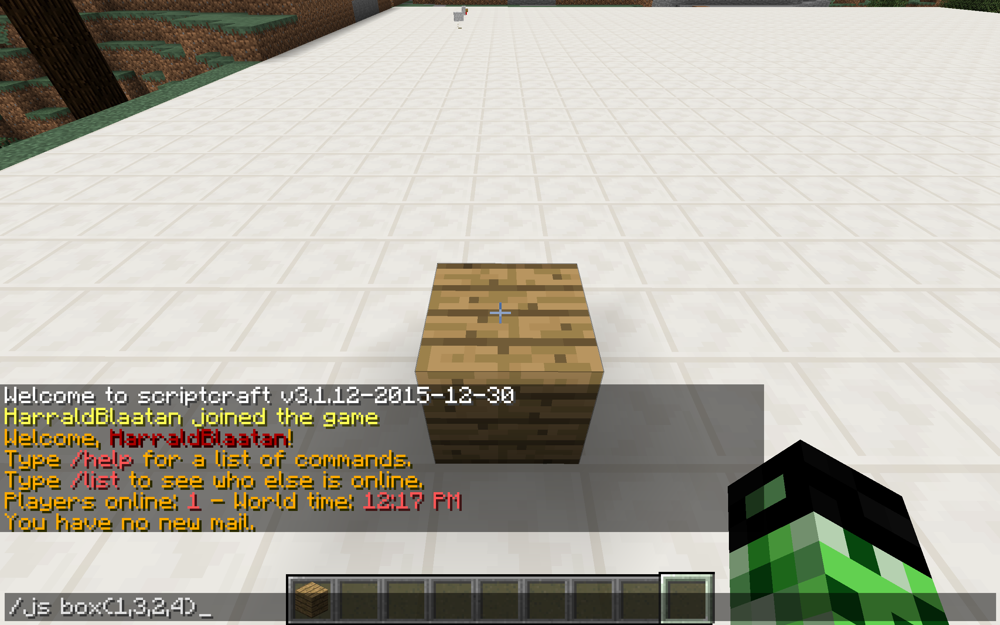
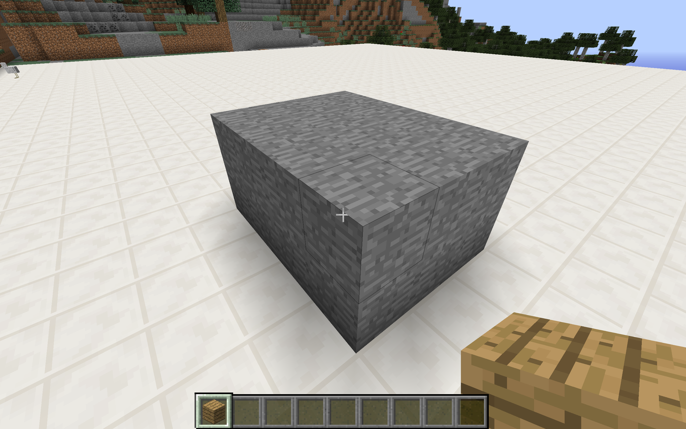

# Øving 1 Koding i minecraft med scriptcraft

Ønsker du å lære litt om koding?
Du kan bruke koding til å bygge hus, sukker plantasje, labyrinter og mye mer.
Du kan også lage minispill. Det er bare fantasien som setter begrensninger for hva du kan få til!

Her får du en liten introduksjon til programmering med scriptcraft.
Vi begynner med noen enkle eksempler.

## 1 Bygge en boks

